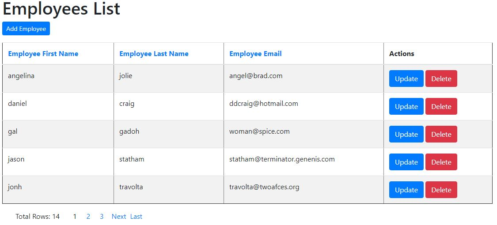

# Spring_Boot
Iniciando um projeto simples usando spring boot e suas principais classes para realizar um CRUD completo.

&nbsp;

### 👨🏻‍💻 &nbsp;Tecnologias Utilizadas

- Java 8

- Spring Boot

- Spring MVC

- Spring Data JPA

- Hibernate

- Banco de dados My Sql

- Thymeleaf 

- Bootstrap 

